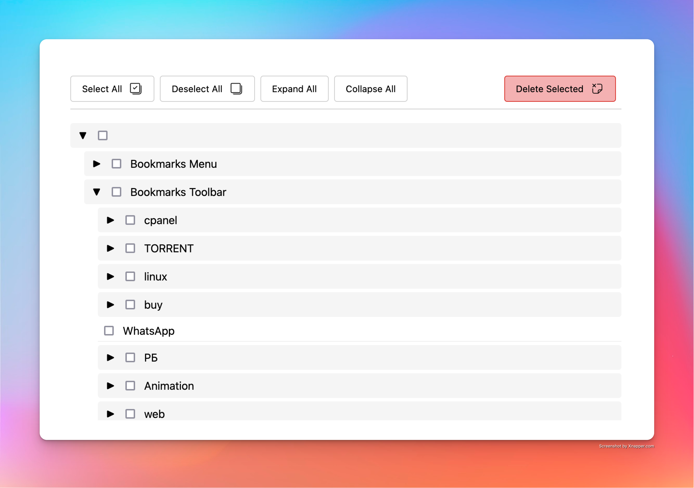

# 🔖 Firefox Bulk Bookmark Manager (that's a mouthful)

A Firefox extension that makes managing your bookmarks easier with bulk operations, folder organization, and intuitive selection tools.




## ✨ Features

- **Bulk Selection & Deletion**
  - Select multiple bookmarks with shift-click
  - Delete multiple bookmarks at once
  - Select/deselect all with one click

- **Folder Management**
  - Collapsible folder structure
  - Expand/collapse all folders
  - Nested folder support
  - Delete entire folders and their contents

- **User-Friendly Interface**
  - Full-page management view
  - Clean, modern design
  - Easy access via toolbar icon
  - Intuitive visual hierarchy

## 🚀 Installation

### Development Version

1. Clone this repository:
   ```bash
   git clone https://github.com/alexKov24/bookmark-manager.git
   ```

2. Open Firefox and navigate to:
   ```
   about:debugging#/runtime/this-firefox
   ```

3. Click "Load Temporary Add-on"

4. Select any file from the extension directory

### From Firefox Add-ons (Coming Soon)

The extension will be available on the Firefox Add-ons store after review.

## 🛠️ Project Structure

```
firefox-bookmark-manager/
├── assets/
├── manifest.json
├── background.js
├── settings.html
└── settings.js
```

## 📝 Usage

1. Click the extension icon in your toolbar to open the bookmark manager
2. Browse through your bookmarks and folders
3. Select bookmarks using:
   - Individual clicks
   - Shift-click for range selection
   - "Select All" button
4. Use the toolbar buttons to:
   - Expand/collapse all folders
   - Select/deselect all bookmarks
   - Delete selected items

## 🤝 Contributing

Contributions are welcome! Please feel free to submit a Pull Request.

1. Fork the repository
2. Create your feature branch:
   ```bash
   git checkout -b feature/AmazingFeature
   ```
3. Commit your changes:
   ```bash
   git commit -m 'Add some amazing feature'
   ```
4. Push to the branch:
   ```bash
   git push origin feature/AmazingFeature
   ```
5. Open a Pull Request

## 📜 License

This project is licensed under the MIT License - see the [LICENSE](LICENSE) file for details.

## 🔜 Upcoming Features

- [ ] Drag and drop reordering
- [ ] Search functionality
- [ ] Export/import capabilities
- [ ] Keyboard shortcuts
- [ ] Bookmark editing
- [ ] Custom folder colors
- [ ] Multiple selection modes

## 🐛 Known Issues

- None reported yet! Please submit issues on GitHub.

## 💖 Support

If you like this extension, consider:
- Starring the repository
- Reporting bugs
- Suggesting new features
- Contributing to the code

## 📧 Contact

Alex Kovalev - [kovaelv.alex10@gmail.com](mailto:kovaelv.alex10@gmail.com)

Project Link: [https://github.com/alexKov24/bookmark-manager/](https://github.com/alexKov24/bookmark-manager)
